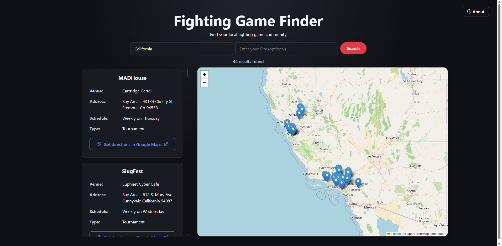

# Fighting Game Finder

Fighting Game Finder is a full-stack web application for discovering active fighting game communities across the United States.

Users can search for local fighting game communities by state and optionally narrow results by metro area. Search results are displayed alongside an interactive map, allowing users to explore venue locations and open directions to a selected venue in Google Maps.



## Features

* Search for active fighting game communities by state
* Optionally narrow searches by metro area
* View search results alongside an interactive map
* Select a result to highlight its venue on the map
* Select map markers to view venue information
* Open directions to venues in Google Maps

## Tech Stack

### Frontend

* React
* TypeScript
* Vite
* Axios
* React Router
* Leaflet / React Leaflet
* OpenStreetMap
* Lucide React

### Backend

* Python
* Flask
* PostgreSQL
* Psycopg

## How It Works

The React frontend sends search requests to a Flask REST API. Searches can specify a state or a combination of state and metro area.

The Flask backend queries a PostgreSQL database containing information about active fighting game communities and returns matching results as JSON. Results containing geographic coordinates are rendered as markers on an interactive Leaflet map using OpenStreetMap tiles.

Result cards and map markers are linked, allowing users to select a community from either the results panel or the map. Venue addresses can also be opened in Google Maps for directions.

## Data

Fighting game community data is sourced from a community-maintained dataset publicly shared by [UltraDavid on X](https://x.com/ultradavid/status/1946352632265916669).

The current version of Fighting Game Finder searches active communities located within the United States.

## Local Development

### Prerequisites

To run Fighting Game Finder locally, you will need:

* Node.js and npm
* Python
* PostgreSQL
* A PostgreSQL database management tool, such as pgAdmin 4 (optional)

### Frontend

The frontend is built with React, TypeScript, and Vite.

Navigate to the frontend directory and install the required packages:

```bash
npm install
```

Start the Vite development server:

```bash
npm run dev
```

### Backend

Install the required Python dependencies:

```bash
pip install -r requirements.txt
```

### Database Setup

The source dataset is included in `backend/data/`. Import the dataset into PostgreSQL using pgAdmin 4 or another PostgreSQL database management tool.

After importing the data, run the included geocoding script to add the latitude and longitude fields used to display venue locations on the map:

```bash
python scripts/geocoding.py
```

Configure the PostgreSQL connection using environment variables. The backend expects the following database environment variables:

```text
DATABASE_USER
DATABASE_PASSWORD
DATABASE_HOST_NAME
DATABASE_PORT
```

A secret key must also be provided through the environment:

```text
SECRET_KEY
```

Start the Flask backend after configuring the database connection:

```bash
flask --app app run
```

> **Note:** Database credentials and other secrets should be stored locally in environment variables and should not be committed to the repository.

## Future Improvements

Potential future improvements include:

* Expanding searches to fighting game communities outside the United States
* Options for filtering results
* Additional search and map functionality

## Developer

Developed by Richard De Sa.

[LinkedIn](https://www.linkedin.com/in/richarddesa/) · [GitHub](https://github.com/rdesa1)
